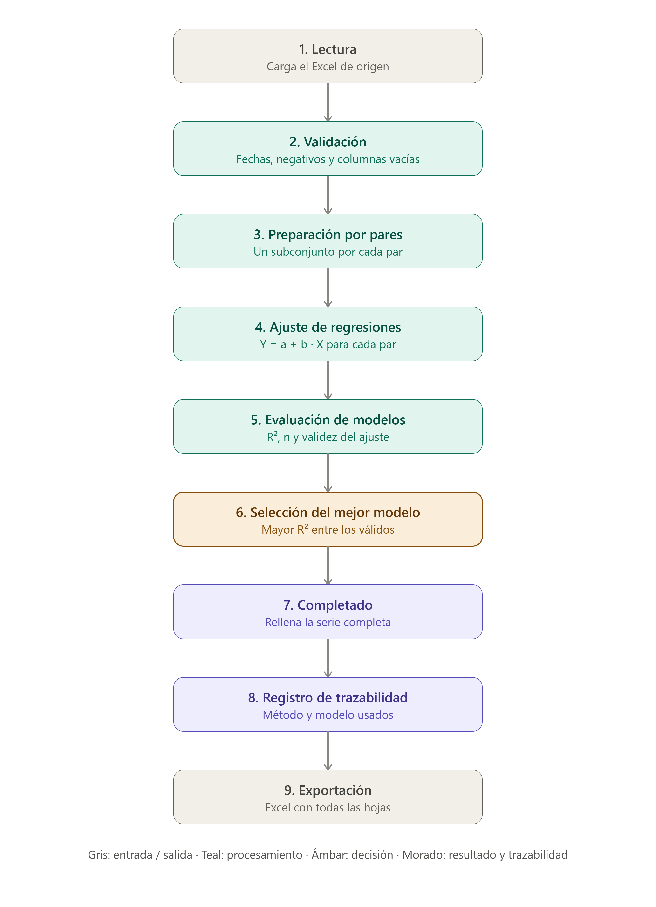

  

preTools
========

Completado de series de precipitación diaria mediante regresión lineal
simple entre estaciones meteorológicas, en R.

----------------------------------------------------------------------
AVISO
----------------------------------------------------------------------

preTools es una herramienta de apoyo técnico y no sustituye la
validación profesional de los datos ni de los resultados obtenidos.

----------------------------------------------------------------------
¿QUÉ PROBLEMA RESUELVE?
----------------------------------------------------------------------

Las series de precipitación diaria de una estación meteorológica casi
siempre tienen huecos (días sin registro, por avería del sensor, falta
de mantenimiento, etc.). Para muchos análisis hidrológicos (balances
hídricos, diseño de infraestructuras, estudios de recursos) se necesita
una serie continua, sin huecos.

preTools completa automáticamente esos huecos utilizando el dato de
otra estación cercana ("estación auxiliar") con la que la estación
incompleta ("estación objetivo") esté bien correlacionada, mediante una
regresión lineal simple:

    Objetivo = a + b · Auxiliar

----------------------------------------------------------------------
¿QUÉ HACE EL SCRIPT, PASO A PASO?
----------------------------------------------------------------------

1. Lectura: carga un Excel con una columna de fecha, una columna de la
   estación a completar y una o varias columnas de estaciones
   auxiliares.

2. Validación: detecta y avisa de fechas no interpretables, columnas
   vacías y valores negativos de precipitación (físicamente
   imposibles), sin modificar nada automáticamente.

3. Preparación por pares: para cada estación auxiliar, construye un
   subconjunto con únicamente las fechas donde tanto la objetivo como
   esa auxiliar (y solo esas dos) tienen dato. Esto aprovecha el
   máximo de información disponible para cada par.

4. Ajuste de regresiones: calcula la recta de regresión para cada par,
   comprobando que el ajuste sea numéricamente válido (variabilidad
   suficiente, coeficientes finitos, R² calculable). Si un ajuste no
   es válido, se descarta sin detener el proceso y queda documentado
   el motivo.

5. Selección del mejor modelo: entre las estaciones auxiliares que
   superan un número mínimo de datos y un R² mínimo (configurables),
   se elige la de mayor R².

6. Completado: aplica la ecuación seleccionada sobre la serie completa
   original, con tres reglas:
     - auxiliar = 0            -> completado = 0
     - auxiliar tiene valor    -> completado = a + b · auxiliar
     - auxiliar también es NA  -> no se completa, queda marcado

7. Trazabilidad: cada valor completado queda registrado con la fecha,
   el método usado, la estación auxiliar empleada y los coeficientes
   del modelo. Cada fila de la serie final queda etiquetada como
   Original / Completado (regresión) / Completado (auxiliar=0) /
   SIN COMPLETAR.

8. Exportación: genera un único Excel con los datos originales, los
   datos completados, el registro de trazabilidad, la tabla resumen de
   todos los modelos evaluados (no solo el elegido) y, para cada par
   objetivo-auxiliar, una hoja con los datos exactamente usados en esa
   regresión.

----------------------------------------------------------------------
ESTRUCTURA DEL REPOSITORIO
----------------------------------------------------------------------

    preTools/
    ├── docs/
    │   └── preTools_flujo_pipeline.png    Diagrama de flujo del proceso
    ├── ejemplos/
    │   └── prueba_preTools.xlsx           Excel de prueba con datos sintéticos
    ├── www/
    │   └── logo.png                       Logo usado por la app en ejecución
    ├── .gitignore
    ├── LICENSE
    ├── README.md
    ├── app.R                              Interfaz Shiny
    ├── logo.png                           Logo mostrado en este README
    └── preTools.R                         Motor de cálculo (independiente de Shiny)

(Este es el orden real en el que GitHub los mostrará: primero las
carpetas por orden alfabético, después los archivos, también por
orden alfabético pero distinguiendo mayúsculas de minúsculas — las
mayúsculas se listan antes que las minúsculas.)

`preTools.R` puede usarse de forma completamente independiente,
directamente desde R/RStudio, sin necesidad de Shiny ni de ninguna
interfaz. `app.R` es una capa de interfaz que llama a las funciones de
`preTools.R` (mediante `source("preTools.R")`), sin duplicar ni
modificar su lógica.

----------------------------------------------------------------------
TECNOLOGÍA
----------------------------------------------------------------------

R (readxl, dplyr, purrr, writexl, tibble, stringr), interfaz web con
Shiny. Sin dependencias fuera del ecosistema estándar de R para manejo
de datos.

----------------------------------------------------------------------
ESTADO ACTUAL
----------------------------------------------------------------------

Prototipo funcional, probado tanto con datos reales de estaciones de
precipitación como con un caso de prueba sintético diseñado a propósito
para verificar cada regla de completado (regresión, auxiliar=0,
auxiliar=NA, valores negativos, columnas vacías).

Completa actualmente una única estación objetivo por ejecución (la
segunda columna del Excel de entrada).

----------------------------------------------------------------------
PRÓXIMOS PASOS
----------------------------------------------------------------------

- Extender el proceso para completar varias estaciones objetivo en una
  misma ejecución.
- Explorar criterios de selección adicionales (RMSE, distancia entre
  estaciones), manteniendo la metodología actual como base.

----------------------------------------------------------------------
AUTOR
----------------------------------------------------------------------

Proyecto personal de Raúl Gómez C., orientado a facilitar el flujo de trabajo de
oficinas de gestión de recursos hídricos.
